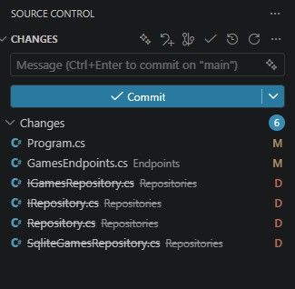

# 🚀 Estudo de Caso: O Impacto do Repository Pattern com EF Core no .NET 10

Este repositório foi criado para estudar, na prática, a real necessidade de aplicar o **Repository Pattern** em aplicações modernas que utilizam o **Entity Framework Core** e **Minimal APIs** no .NET 10.

O objetivo principal foi comparar a complexidade de código, performance e manutenibilidade entre duas abordagens de arquitetura de dados.

---

## 🧐 O Problema: A "Armadilha" do Repository Pattern

Por muito tempo, a criação de interfaces como `IRepository<T>` e classes genéricas base foi considerada uma "boa prática" incontestável no ecossistema C#. Os principais argumentos para utilizá-la sempre foram:

1. **Independência de Banco de Dados:** A promessa de poder trocar de banco (ex: SQLite para SQL Server) alterando apenas uma linha de código.
2. **Testabilidade:** Facilidade para buildar testes de unidade mockando as interfaces do repositório.

### A Realidade Prática

Durante o desenvolvimento deste projeto, ficou evidente que o **DbContext do EF Core já é, por si só, uma implementação do padrão Repository/Unit of Work**. Ao criar uma nova camada de repositório por cima dele, acabamos gerando uma **abstração sobre outra abstração**, resultando em:

- Código redundante (_Boilerplate_).
- Perda de flexibilidade nativa do LINQ nos endpoints.
- Complexidade desnecessária para operações simples de CRUD.

---

## 🛠️ O Experimento

O projeto foi dividido e desenvolvido em duas etapas distintas para análise:

### Parte 1: Abordagem com Repository Pattern (Para consulta verifique a branch repositorrypattern)

Foi implementada uma estrutura completa de abstração:

- `BaseEntity` e `IRepository<T>` genérico.
- `Repository<T>` implementando métodos base do EF Core.
- `IGamesRepository` e `SqliteGamesRepository` para regras específicas (como buscas complexas com `.Include()`).
- Injeção de dependência explícita de cada repositório no `Program.cs`.

### Parte 2: Refatoração para Uso Direto do DbContext (Abordagem Atual - Versionada na branch main)

Os endpoints da Minimal API foram refatorados para receber diretamente o `GameStoreContext`. As consultas passaram a utilizar o poder nativo do EF Core diretamente nas rotas, aproveitando recursos como carregamento explícito (`DbContext.Entry().Reference().LoadAsync()`) e projeções diretas para DTOs.

---

## 📊 Resultados: Menos Código, Mesma Eficiência

A maior prova do impacto dessa refatoração está no controle de versão. Ao eliminar a camada de repositório desnecessária, foi possível **deletar arquivos inteiros de infraestrutura**, tornando o projeto muito mais limpo e focado no que realmente importa: a regra de negócio.

Visualmente, a limpa no projeto ficou assim no painel do Source Control:

### 🔍 Conclusões do Estudo

1. **A mítica troca de Banco de Dados:** Em ambientes de produção reais, a troca completa de um motor de banco de dados é extremamente rara. Mesmo que ocorra, o Repository Pattern não resolve problemas críticos como migração de dados e dialetos SQL específicos. O EF Core já lida com a troca de provedores nativamente de forma muito eficiente.
2. **Estratégia de Testes:** Testar controllers ou endpoints de API com testes de unidade puramente mockados gera falso sentimento de segurança. Para a camada de exposição da API (Endpoints), **testes de integração** utilizando o banco de dados em memória (ou SQLite local) geram muito mais valor e cobrem o comportamento real da aplicação.
3. **Manutenibilidade:** Menos código escrito significa menos código para manter, debugar e atualizar no futuro.

---

## 💻 Tecnologias Utilizadas

- **.NET 10** (Minimal APIs)
- **Entity Framework Core 10**
- **SQLite** (Como banco de dados local em modo WAL)
- **VS Code** (Como IDE de desenvolvimento)

---

## 🧠 Análise Técnica: Usar ou não o Repository Pattern?

Após experimentar as duas abordagens, o cenário de engenharia de software atual nos traz insights profundos sobre essa decisão arquitetural:

### Por que o uso direto do DbContext se destaca hoje?

- **O EF Core evoluiu:** O `DbContext` moderno já é, por definição, uma implementação robusta dos padrões _Repository_ (via `DbSet`) e _Unit of Work_ (via `SaveChangesAsync`). Criar uma nova camada sobre ele frequentemente resulta em redundância de código (_Boilerplate_).
- **Fim do "Menor Denominador Comum":** Repositórios genéricos tendem a limitar o poder do EF Core. Operações otimizadas como `.Include()`, `.Select()` cirúrgicos ou `.AsNoTracking()` muitas vezes exigem a criação de métodos customizados para cada entidade (como o `GetByIdWithGenreAsync`), quebrando o propósito de uma abstração genérica única.
- **Sinergia com Minimal APIs:** O design das Minimal APIs foi projetado para ser enxuto, direto e de alta performance. Injetar o `DbContext` diretamente nos endpoints respeita essa filosofia, reduzindo o custo de manutenção e facilitando a leitura do fluxo de dados.

### Onde o Repository Pattern ainda possui espaço?

A extinção do padrão não é absoluta. Ele ainda encontra justificativa em cenários específicos de arquitetura corporativa:

1. **Múltiplas Fontes de Dados (Polyglot Persistence):** Quando um único endpoint precisa consolidar dados vindos de bancos relacionais (SQL), não-relacionais (NoSQL) e APIs externas, o repositório envelopa essa complexidade.
2. **Domain-Driven Design (DDD) Estrito:** Em sistemas complexos, o repositório blinda o Domínio, garantindo que as regras de negócio interajam apenas com a raiz de um Agregado (ex: acessar `Pedido`, impedindo a manipulação isolada de `ItemPedido`).

### Conclusão do Estudo de Caso

Para microsserviços, APIs baseadas em CRUDs e arquiteturas modernas (como _Vertical Slice Architecture_), eliminar a camada de repositório e utilizar o framework nativo entrega código mais limpo, desenvolvimento ágil e menor débito técnico. **Menos código escrito significa menos código para manter.**
